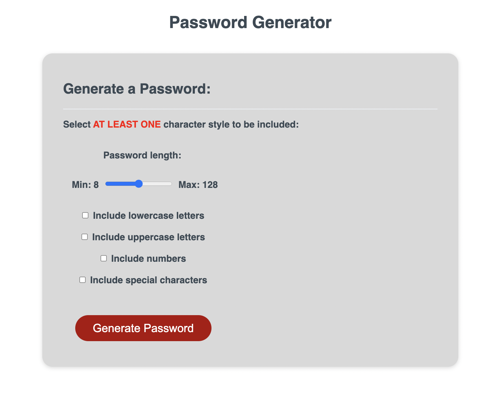

# Password Generator

<center>

</center>

## Table of Contents
  1. [Description](#description) 
  2. [Installation](#installation)
  3. [Usage](#usage)  
  4. [Contributing](#contributing)
  5. [Tests](#tests)
  6. [License](#license)
  7. [Questions](#questions)
  8. [E-mail](#e-mail)

## Description
This is application is a random password generator, powered by javascript. There are multiple customization options available to modify the contents of the generated passwords. Modification options include: ```Length, Lower and Upper Case Letters, Numbers and Special Characters.``` 

## Installation
Application is run through HTML. To view the live application, open the ```index.html``` file in your default browser. No installation necissary.

## Usage
To use the application, there a mutiple customization options to change the contents of the password being generated. By default, this application has no options to include characters selected. If no boxes are checked, no password will be generated.

## Contributing
This is mostly a stable application, if you would like to contribute, feel free to reach out through GitHub or see more contact information below.

## Tests
There are no tests designed for this application.

## License
 

## Questions
[github icon](./github-icon-small.png)
Github Profile: [dubosews](https://github.com/dubosews)
Contact Email: [wsd10205@gmail.com](mailto:wsd10205@gmail.com)
Directions for reaching out with further questions:
    Feel free to reach out to me through GitHub with questions or comments. If you would like to email me about this application, please include the title of the repository in the subject line of the email.
